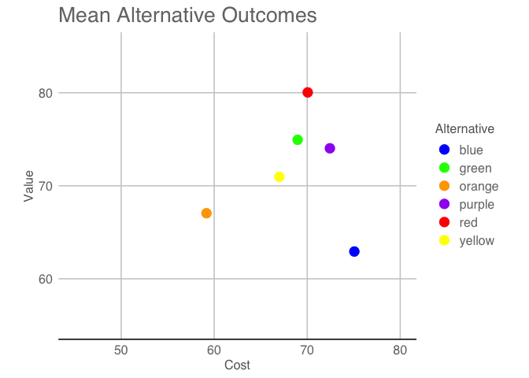
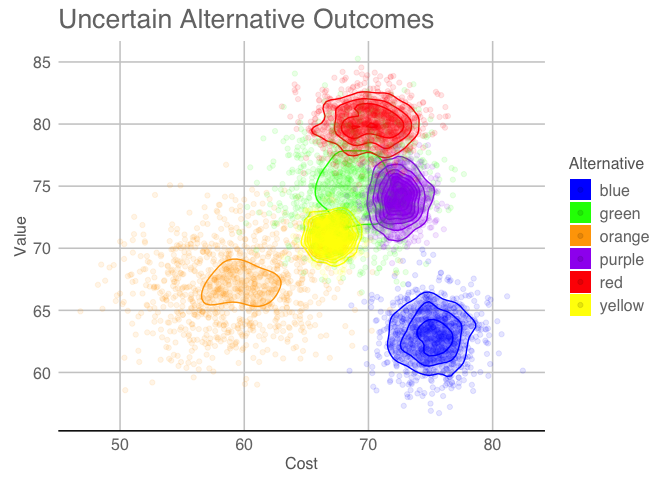
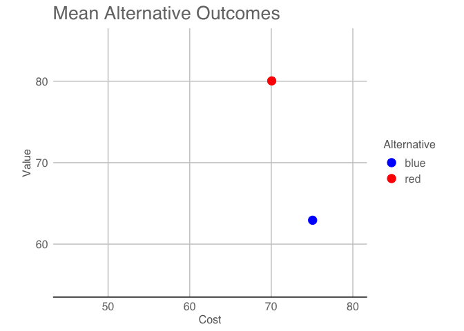
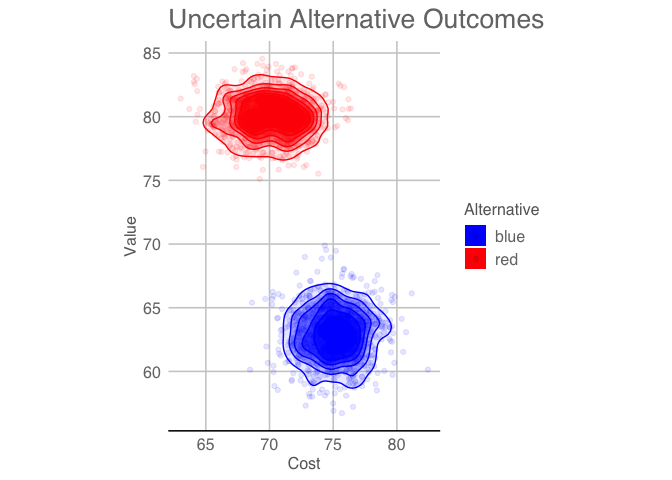
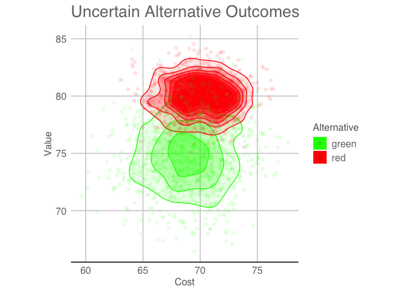
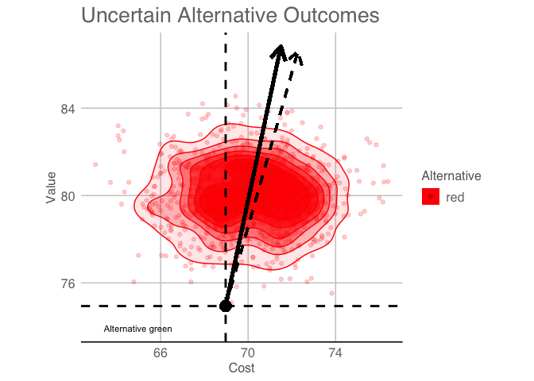
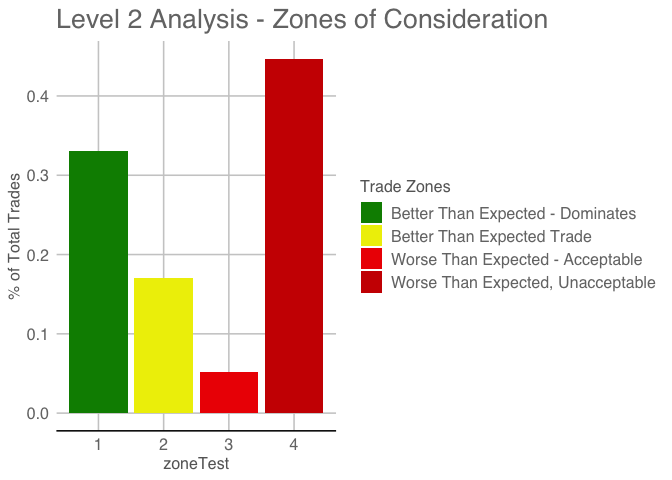

valueR - helping characterize uncertainty in value modeling
================

This R package can be installed with
devtools::install_github(“caddell/valueR”)

Please review the associated paper (<https://doi.org/10.1002/mcda.1717>)
for details and cite as appropriate.

``` r
#install from github if needed
#devtools::install_github("caddell/valueR")
library(valueR)
#cite using citation
citation("valueR")
```

    ## 
    ## To cite valueR in publications use:
    ## 
    ##   Caddell, John & Dabkowski, Matthew & Driscoll, Patrick & DuBois,
    ##   Patrick. (2020). Improving stochastic analysis for tradeoffs in
    ##   multi‐criteria value models. Journal of Multi-Criteria Decision
    ##   Analysis. 27, 304-317. URL https://doi.org/10.1002/mcda.1717
    ## 
    ## A BibTeX entry for LaTeX users is
    ## 
    ##   @Article{,
    ##     title = {Improving Stochastic Analysis for Tradeoffs in Multi-Criteria Value Models},
    ##     author = {John Caddell and Matthew Dabkowski and Patrick Driscoll and Patrick DuBois},
    ##     journal = {Journal of Multi-Criteria Decision Analysis},
    ##     year = {2020},
    ##     volume = {27},
    ##     number = {5-6},
    ##     pages = {304-317},
    ##     url = {https://doi.org/10.1002/mcda.1717},
    ##   }

``` r
library(tidyverse)
library(ggthemes)
```

Build a set of alternatives for us to investigate.

``` r
set.seed(123)
n = 1000

orange = tibble(
  alternative = c(rep("orange", n)),
  value = c(rnorm(n, mean= 67, sd=3)),
  cost = c(rnorm(n, mean = 59, sd= 4))
)

green = tibble(
  alternative = c(rep("green", n)),
  value = c(rnorm(n, mean= 75, sd=3)),
  cost = c(rnorm(n, mean = 69, sd= 3))
)

blue = tibble(
  alternative = c(rep("blue", n)),
  value = c(rnorm(n, mean= 63, sd=2)),
  cost = c(rnorm(n, mean = 75, sd= 2))
)

yellow = tibble(
  alternative = c(rep("yellow", n)),
  value = c(rnorm(n, mean= 71, sd=1)),
  cost = c(rnorm(n, mean = 67, sd=1))
)

purple = tibble(
  alternative = c(rep("purple", n)),
  value = c(rnorm(n, mean= 74, sd=1.5)),
  cost = c(rnorm(n, mean = 72.5, sd=1.25))
)

red = tibble(
  alternative = c(rep("red", n)),
  value = c(rnorm(n, mean= 80, sd=1.5)),
  cost = c(rnorm(n, mean = 70, sd=2.25))
)

#bind all alternatives together for future use
all.alternatives = rbind(orange, green, blue, yellow, purple, red)
```

## Plot the data

The first step to any problem: Visualize the data. This is how we
normally see the out put of simulation.

``` r
#plot alternative as mean of alternatives
mean.alt = all.alternatives %>% group_by(alternative) %>% summarise_all(mean)

#plot means of alternatives
ggplot(data = mean.alt, aes(x = cost, y = value, color = alternative, fill = alternative))+
  theme_gdocs()+
  geom_point(size = 4)+
  labs(x = "Cost", y = "Value", title = "Mean Alternative Outcomes", color= "Alternative")+
  guides(fill = FALSE, alpha = FALSE)+
  coord_fixed(xlim = c(45,80), ylim = c(55,85))+
  theme(plot.background=element_blank())+
  scale_color_manual(values = c("blue", "green", "orange", "purple","red","yellow"))
```

<!-- -->

## Plot ALL the data

Try it again with all the alternatives and densities.

``` r
#plot alternative as points w/ densities
ggplot(data = all.alternatives, aes(x = cost, y = value, color = alternative, fill = alternative))+
  theme_gdocs()+
  stat_density2d(aes(alpha=..level.., color = alternative), bins = 20, geom = "polygon")+
  geom_point(alpha = .1)+
  labs(x = "Cost", y = "Value", title = "Uncertain Alternative Outcomes", fill= "Alternative")+
  guides(color = FALSE, alpha = FALSE)+
  coord_fixed()+
  theme(plot.background=element_blank())+
  scale_fill_manual(values = c("blue", "green", "orange", "purple","red","yellow"))+
  scale_color_manual(values = c("blue", "green", "orange", "purple","red","yellow"))
```

<!-- -->

This visualization helps us better understand the spread and uncertainty
of an alternative. It gives the stakeholder more information.
Unfortunately, this can be unhelpful at times and lead to decision
paralysis. What do we do next?

## Level 1 Anlaysis

We’ve found it helpful to talk about alternative pairwise comparisons in
terms of dominance. In general, you have four types of dominance. An
alternative is dominate over another if the alternative returns more
value at the same or less cost. Naturally it is, dominated if it returns
less value for more cost. If an alternative returns more value, but for
more cost, then we consider it pareto-optimal plus. If it has less
value, but costs less, we consider it pareto-optimal minus.

If we consdier the means of our alternatives, we can easily identify
dominance. Lets consider red and blue.

``` r
#plot means of alternatives
ggplot(data = mean.alt %>% filter(alternative == "blue" | alternative == "red"), aes(x = cost, y = value, color = alternative, fill = alternative))+
  theme_gdocs()+
  geom_point(size = 4)+
  labs(x = "Cost", y = "Value", title = "Mean Alternative Outcomes", color= "Alternative")+
  guides(fill = FALSE, alpha = FALSE)+
  coord_fixed(xlim = c(45,80), ylim = c(55,85))+
  theme(plot.background=element_blank())+
  scale_color_manual(values = c("blue","red"))
```

<!-- -->

As we can see, red returns more value for less cost and is therefore
dominate. But if we consider all the data we understand it isn’t that
simple.

``` r
#plot alternative as points w/ densities
ggplot(data = all.alternatives %>% filter(alternative == "red" | alternative == "blue"), aes(x = cost, y = value, color = alternative, fill = alternative))+
  theme_gdocs()+
  stat_density2d(aes(alpha=..level.., color = alternative),geom = "polygon")+
  geom_point(alpha = .1)+
  labs(x = "Cost", y = "Value", title = "Uncertain Alternative Outcomes", fill= "Alternative")+
  guides(color = FALSE, alpha = FALSE)+
  coord_fixed()+
  theme(plot.background=element_blank())+
  scale_fill_manual(values = c("blue", "red"))+
  scale_color_manual(values = c("blue", "red"))
```

<!-- -->

In this case, we’ve decided to compare all possible combinations. We
call this Level 1 Analysis.

``` r
level1_red_blue = level1(red, blue, 500)
```

    ## [1] "Sample size of 11279 pairings selected by Cochran's formula"

``` r
level1_red_blue$final_table
```

    ##                               final_count   percent
    ## red.dominate                        10767 0.9546059
    ## red.dominated                           0 0.0000000
    ## red/blue.pareto_optimal_plus          512 0.0453941
    ## red/blue.pareto_optimal_minus           0 0.0000000

From this analysis we can tell that red is a more dominate alternative.
In fact, we can tell you that it will dominate blue over 95% of the
time. This adds another layer of understanding for a decision maker.
They probably didn’t need it for this simple of a solution, but this
style of analysis lends it self to more complicated decisions.

``` r
#plot alternative as points w/ densities
ggplot(data = all.alternatives %>% filter(alternative == "red" | alternative == "green"), aes(x = cost, y = value, color = alternative, fill = alternative))+
  theme_gdocs()+
  stat_density2d(aes(alpha=..level.., color = alternative),geom = "polygon")+
  geom_point(alpha = .1)+
  labs(x = "Cost", y = "Value", title = "Uncertain Alternative Outcomes", fill= "Alternative")+
  guides(color = FALSE, alpha = FALSE)+
  coord_fixed()+
  theme(plot.background=element_blank())+
  scale_fill_manual(values = c("green", "red"))+
  scale_color_manual(values = c("green", "red"))
```

<!-- --> This plot is
much more interesting, but it would be helpful to quantify the
alternatives.

``` r
level1_green_red = level1(green,red)
```

    ## [1] "Sample size of 9151 pairings selected by Cochran's formula"

``` r
level1_green_red$final_table
```

    ##                                final_count    percent
    ## green.dominate                         334 0.03649874
    ## green.dominated                       3298 0.36039777
    ## green/red.pareto_optimal_plus          234 0.02557098
    ## green/red.pareto_optimal_minus        5285 0.57753251

## Level 2

Lets suppose that our decision maker is comfortable “picking” the red
alternative. We should try and give them an expectation of this choice.

``` r
expectations = level2(green,red, .25)
expectations$trade
```

<!-- --> So how happy
are we?

``` r
expectations$hist
```

<!-- -->
